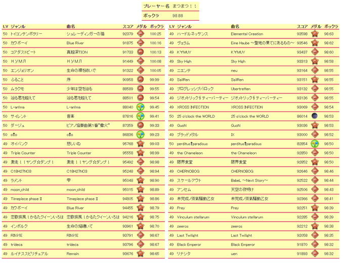

# popn-class

팝클래스에 포함되는 곡 목록을 보여주는 스크립트입니다.


# 사용 방법

1. 다음의 스크립트를 북마크에 추가해주세요.

```
javascript: void !function(e){var t=e.createElement("script");t.type="text/javascript",t.src="///cdn.jsdelivr.net/gh/sonohoshi/popn-class/dist/bundle.js",e.head.appendChild(t)}(document);
```


2. [팝픈 웹페이지](https://p.eagate.573.jp/game/popn/unilab/playdata/index.html)에서 로그인 뒤, 북마크를 클릭합니다.

# Contribute

Issue 혹은 Pull Request로 부탁드려요.

## Build

```
yarn build // or yarn build:watch
```

## Test

유닛테스트가 없습니다... 수동으로 테스트 해주셔야 합니다.

## PR때 주의점

github상의 파일을 호스트하는 CDN [jsdelivr](https://cdn.jsdelivr.net/)를 사용해 배포하고 있으므로, 'dist/bundle.js'도 함께 커밋해 주세요.
