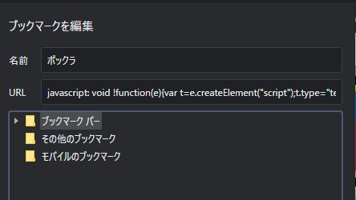

# popn-class

팝클래스에 포함되는 곡 목록을 보여주는 스크립트입니다.  
코나미 베이직 코스에 가입되어있지 않으면 곡 데이터를 가져올 수 없어 사용이 불가능합니다.


# 0.30 update
* 함수 호출 시 레벨 파라미터를 받고, 그 범위에 해당하는 레벨만 조회하도록 수정
* 해당 레벨 페이지 번호를 먼저 체크 후 유효한 범위만 조회하도록 수정

# 0.25 update
* 잼앤피즈 대응

# 0.21 update
* 이미 최상위 레벨이 대상곡인 사람들을 위해 49, 50만 빠르게 긁어오도록 수정
  * 개인 용도로 수정한 것으로, 1 ~ 48 유저 분들은 0.2버전 사용 필요..

# 0.22 update
* 팝클 후보군 리스트를 20개 뽑아서 같이 보여주도록 수정
  * 조금만 더 점수 올리면 되거나, 풀콤 하면 바로 팝클 대상곡에 들 수 있는 곡들 (팝클 순위 51위 ~ 70위)

# 사용 방법

1. 다음의 스크립트를 북마크에 추가해주세요.

```
javascript: void !function(e){var t=e.createElement("script");t.type="text/javascript",t.src="///cdn.jsdelivr.net/gh/shuashua-ko/popn-class@v0.21/dist/bundle.js",e.head.appendChild(t)}(document);
```



2. [팝픈 웹페이지](https://p.eagate.573.jp/game/popn/unilab/playdata/index.html)에서 로그인 뒤, 북마크를 클릭합니다.

# Contribute

Issue 혹은 Pull Request로 부탁드려요.

## Dependencies

1. yarn
2. webpack
3. webpack-cli

## Build

```
yarn build // or yarn build:watch
```

## Test

유닛테스트가 없습니다... 수동으로 테스트 해주셔야 합니다.

## PR때 주의점

github상의 파일을 호스트하는 CDN [jsdelivr](https://cdn.jsdelivr.net/)를 사용해 배포하고 있으므로, 'dist/bundle.js'도 함께 커밋해 주세요.
